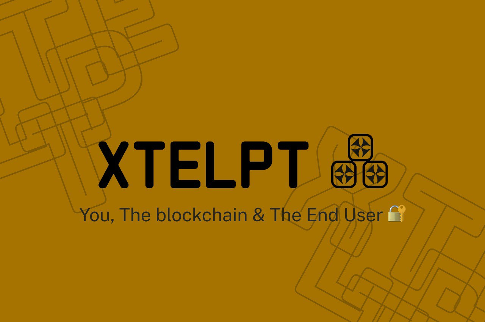

    
<p align="center">
    <a target="_blank" href="https://docs.soliditylang.org/"></a> <a target="_blank" href="https://docs.chain.link/"></a>
    </p>
    <p align="center">
    This repository contains the <strong>Solidity</strong> source code written with <b>hardhat</b> framework.
    Xtelpt is developed to ease the process of people taking therapy and to provide a safe, secure and decentralized method of therapy sessions.
    </p>
    <p align="center">
    <a href="#introduction">Introduction</a> &nbsp;&bull;&nbsp;
    <a href="#technologies">Technologies Used</a> &nbsp;&bull;&nbsp;
    <a href="#installation">Installation</a> &nbsp;&bull;&nbsp;
    <a href="#usage">Usage</a> &nbsp;&bull;&nbsp;
    <a href="#documentation">Documentation</a> &nbsp;&bull;&nbsp;
    <a href="#issue">Issue?</a>
    </p>

# Introduction
This <b>smart contract</b> was written with ```solidity```, ```hardhat```, ```chainlink``` and ```quicknode```. It's has features such as:
- Creating of user or in this case a patient profile.
- Creating of a host or doctor's profile.
- Ability for a host to create a meeting and a user to enter the meeting.
- Ability to mint an NFT pass.
- Becoming a volunteer for a campaign.

<p><b>Xtelpt Smart Contract:</b> https://mumbai.polygonscan.com/address/0x571eefb0C86b8d281DF6C6520625BC86569cC60b</p>
<p><b>Xtelpt NFT Smart Contract:</b> https://mumbai.polygonscan.com/address/0xdF9Bcdc7e7c6de0E380a0854B154f3766Be9D00E</p>
<p><b>Chainlink automation:</b> https://automation.chain.link/mumbai/77351944890237253732333929987139030108293891748301210610819233872091560498155</p>


# Technologies Used

### Ipfs
I made use of pinata IPFS API using file storage to save profile images and return a cid key in other to store on the blockchain so I can retrieve the image at anytime for the account profile.

### Chanlink Automation
Chainlink automation is used to call the end meeting function which is to be called every 24hours I made use of the Time based trigger cron jobs on the chainlink automation interface
Here is link to the chainlink automation: https://automation.chain.link/mumbai/15126042871348539617950456361182166757342351262351933592710991110229343694907

### QuickNode
I used quicknode API to help deploy my smart contract using the Polygon Mumbai test net on the blockchain, it is reliable scalable and work across all major blockchains 


## Installation
clone the repo
##### yarn
```
cd smart-contract
yarn
```
##### npm
```
cd smart-contract
npm install
```
## Usage
### How to deploy the smart contract:<br/>
```
yarn hardhat deploy --network mumbai
```
## Documentation

## XTELPT contract
Multiple methods provide ways to interact with the XTELPT smart contract. Those are listed below in detail.
#### 1. Changing the meeting access
```
createUser(string memory _year, string memory _month);
```
This function can only called by the owner of the contract to change the meeting access pass details, which is the requirement on the NFT needed to enter a meeting
#### 2. Checking Access
```
 function checkAccess(string memory _year, string memory _month) public onlyOwner view returns(bool) {
        if(keccak256(abi.encodePacked(AccessPass.month)) == keccak256(abi.encodePacked(_month))
         && keccak256(abi.encodePacked(AccessPass.year)) == keccak256(abi.encodePacked(_year)) ) {
             return true;
         } else {
             return false;
         }
    }
```
Only the owner of the contract can call this function it helps to check if a user nft has the required attribute meeting the access requirement.
#### 3. How to create a User profile
```
createUser(uint256 _rating, string memory _name, string memory _pic, string memory _bio);
```
This will create the a User profile using your public address which is the ```msg.sender```.
```_rating``` is a integer, while ```_name _pic _bio``` are string.
#### 4. How to create a Host profile
```
createHost(uint256 _rating, string memory _name, string memory _pic, string memory _bio);
```
This will create the a Host profile using your public address which is the ```msg.sender```.
```_rating``` is a integer, while ```_name _pic _bio``` are string.
#### 5.  How to Create a Schedule or Meeting
Only an account with a **Host** in order to create a schedule four parameters are required which are ```start```, ```end```, ```fee``` and ```desc```.
```
createSchedule(uint256 _start, uint256 _end, uint256 _fee, string memory _desc)
```
#### 6. Joining a Meeting
Only **User** can call this function, it takes the address of a specific host and the ID of a meeting created and assign the user to the meeting
```
joinMeeting(address _host, uint256 _id)
```
#### 7.  Creating a Campaign
Only an account with a **User** can create a campaign, when this function is called it creates a campaign and assigns randomly any volunteer which is a host when a user getHelp if host are avaliable in the particular campaign and then the campaigns start, it gives the user ability to create a meeting between user and a random **host**.
```
createCampaign(string memory _name, string memory _desc, string memory _image)
```
#### 8.  Get Help
Only an account with a **User** can call the getHelp function it assigns the user to the campaign and assigns a host from the list of volunteers for the campaign to the meeting.
```
getHelp(uint256 _id)
```
#### 9.  Ending a campaign
Only an account with a **User** can end a campaign, when this function is called it takes the address of the **User** and the **Id** of the campaign in order to close the campaign
```
endCampaign(address _user, uint256 _id)
```
#### 10.  End meeting function called by chainlink automation
This is the ```chainlink``` automation function which is called every 24hrs.
<a href="https://automation.chain.link/mumbai/41752764193460630660259591557567796324121401828891767850615051925910905870876" target="_blank">Link</a> to the automation 
```
function endMeeting() public {
         for (uint i = 0; i < AllAccount.length; i++) {
            for (uint j = 0; j < Meeting[AllAccount[i]].length; j++) { 
                Meeting[AllAccount[i]][j].completed = true;
                lastTimeStamp = block.timestamp;
                Meeting[AllAccount[i]][j].host.transfer(Meeting[AllAccount[i]][j].fee);
            }
        }
    }
 ```
#### 11.  Edit Campaign only owner
This function can only be called by the owner of the smart contract to make changes to the campaign that is still active
```
function editCampaign(uint256 _id, string memory _name, string memory _desc, string memory _image) public onlyOwner {
    Campaign[_id].name = _name;
    Campaign[_id].image = _image;
    Campaign[_id].desc = _desc;
}
```
#### 12.  Getter Functions
This is used to get variables, struct which the frontend can interact with.

## XTELPT NFT contract
Multiple methods provide ways to interact with the XTELPT smart contract. Those are listed below in detail.
#### 1. minting NFT
```
function safeMint(address to, string memory uri, uint256 num) public{
        for(uint256 i = 0; i < num; i++){
            uint256 tokenId = _tokenIdCounter.current();

            _tokenIdCounter.increment();
            _safeMint(to, tokenId);
            _setTokenURI(tokenId, uri);

            ownedNFT memory NewNFT;
            NewNFT.uri = uri;
      
            myNFT[msg.sender].push(NewNFT);

        }
    }

```
This function takes the address to mint the NFTs, the uri or ipfs hash, and the number of NFTs to be minted

#### 2. getting NFT
```
function getMyNFT(address _addr) public view returns (ownedNFT [] memory) {
        return myNFT[_addr];
    }

```
This function takes the address of a user and returns an array of uri of nfts.

<h4>Liked the work ?</h4>
Give the repository a star :-)
